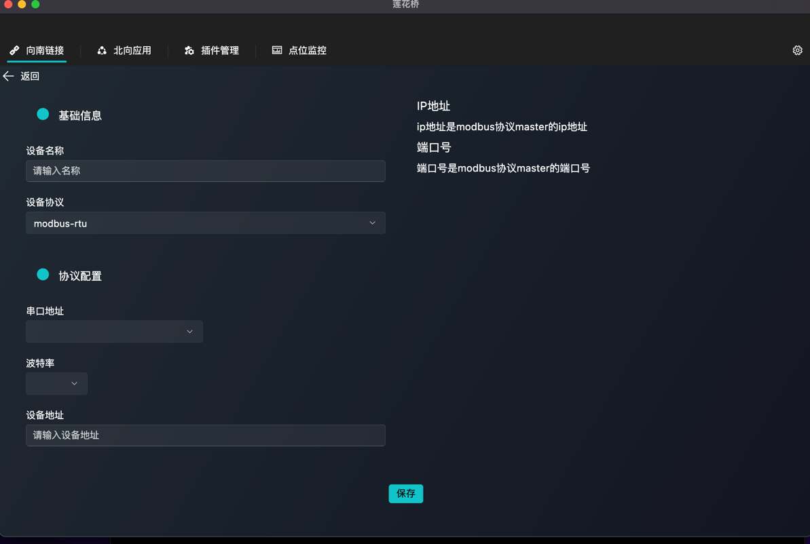

# LotusBridge桌面管理软件

[](LICENSE)

此项目是LotusBridge 的桌面应用,了解LotusBridge请访问:

https://github.com/dingdaoyi/lotus_bridge_window


## 启动项目
如果您只想下载执行文件,可以从actions下载:
https://github.com/dingdaoyi/lotus_bridge_window/actions
```bash
git clone https://github.com/dingdaoyi/lotus_bridge_window.git
cd lotus_bridge_window

# windows 打包

flutter build windows

# macos 打包

flutter build macos
```

## 操作说明

### 1. 登录


登录时需要将LotusBridge服务端启动,并且配置好用户名和密码,默认用户名和密码从config文件中获取,如果服务跟跟显示的地址不一致,可以从设置修改

### 2. 南向链接


南向链接时设备管理,展示了简单的设备列表和群组、点位统计

#### 2.1 设备添加

设备添加时需要关联协议,目前支持Modbus协议,后续会支持更多协议,选择协议后会有对应协议的配置项,配置完成后点击保存即可.
#### 2.2 设备群组

设备群组可以将设备分组,方便管理

#### 2.3 设备点位

点位对应设备的数据点,根据设备协议不同,点位可以自动或者手动创建,对于向modbus协议的点位,需要手动创建,点位地址规则见LotusBridge文档

### 3. 规则引擎
待实现

### 4. 北向应用

北向应用为设备数据的接收端,可以是云平台地址,也可以是本地其他计算节点,应用等,目前实现了推送到消智云平台,推送以插件的形式实现,后续会支持更多的插件.

北向应用需要添加设备群组,关联设备群组的点位,将数据推送到对应的应用.

### 5. 插件管理


插件包含: 南向协议插件,北向应用插件,规则引擎插件,插件当前以rust features 的形式添加,后续看能否支持插件的动态加载库文件.

### 6. 点位监控


## 许可证

LotusBridge 是开源项目，遵循 [GPL-3.0 许可证](LICENSE)。

## 联系方式

如有任何问题或反馈，请联系 [yanbing26@qq.com](mailto:yanbing26@qq.com)。